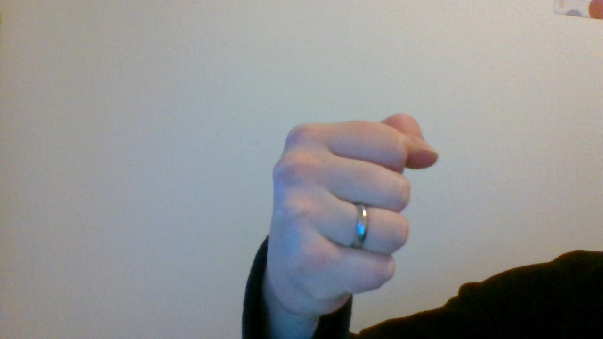
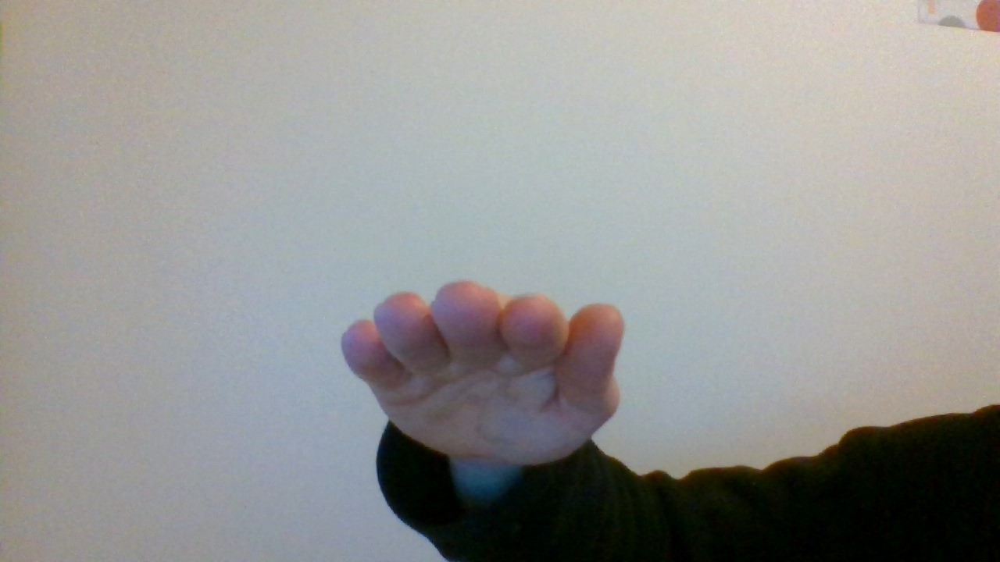
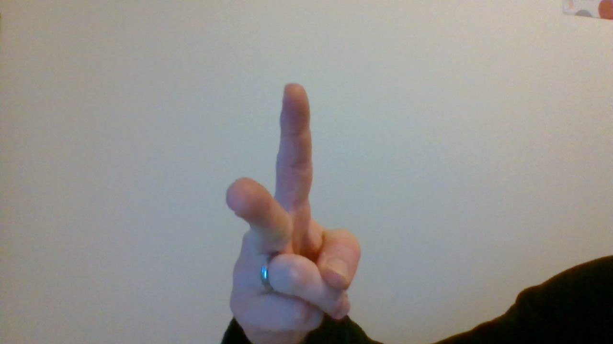

# Computer Vision RPS

This project aims to train a machine learning model that can determine if a human player is playing rock, paper or scissors with a webcam as input. The goal is to create an algorithm that can play the game with a human contestant. Please see below for the technologies used:

- Tensorflow (Model trained via https://teachablemachine.withgoogle.com/)

- Python


## Milestone 1

- The machine learning model was trained to recognise four classes: Rock, Paper, Scissors and Nothing. The training set contained 2300 images, 500 for each possible play and 800 for the Nothing class, to minimise the chances of a false positive.

- The files containing the model were downloaded from Teachable Machine and uploaded to this repository.

- The required dependencies can be found in the requirements.txt

## Milestone 2

Creating python script that allows a user to play RPS with the computer by manually inputting their play:

1. Writing the function get_computer_choice that will randomly pick the computers play from a list of choices.

```
        def get_computer_choice():
            choices_list = ['rock', 'paper', 'scissors']
            choice_index = random.randint(0,2)
            computer_choice = choices_list[choice_index]
            return computer_choice
```

2. Another function called get_user_choice is added that asks the user to input their play and only accepts valid options.

```
        def get_user_choice():
            choices_list = ['rock', 'paper', 'scissors']
            while True:
                user_choice = input("Please select what to play:\n")
                user_choice = str(user_choice).lower()
                if not user_choice in choices_list:
                    #If the user enters anything that isn't a valid play, this message is printed and the user is asked to enter their input again
                    print("That input is not valid. Please choose from rock, paper, scissors.")
                else:
                    return user_choice
                    break
```

3. Finally, the get_winner function takes in the play from both the computer and user and determines who won or if there is a tie. A corresponding statement is then printed to the console. This function goes through the possible scenarios and adds 1 to the score for whoever played the winning game. Everything else will indicate there was a tie.

```
        def get_winner(computer_choice, user_choice):
            computer_choice = computer_choice.lower()
            computer_win = 0
            user_win = 0
            if (computer_choice == 'rock' or user_choice == 'rock') and (computer_choice == 'paper' or user_choice == 'paper'):
                if user_choice == 'paper':
                    user_win += 1
                else:
                    computer_win += 1
            elif (computer_choice == 'rock' or user_choice == 'rock') and (computer_choice == 'scissors' or user_choice == 'scissors'):
                if user_choice == 'rock':
                    user_win += 1
                else:
                    computer_win += 1
            elif (computer_choice == 'paper' or user_choice == 'paper') and (computer_choice == 'scissors' or user_choice == 'scissors'):
                if user_choice == 'scissors':
                    user_win += 1
                else:
                    computer_win += 1
            if user_win > computer_win:
                print('You won!')
            elif user_win == computer_win:
                print('It is a tie!')
            else:
                print('You lost')
```

4. To put the above together into a game, the play function generates the computer's play, asks the user for input and passes the two choices as parameters to the get_winner function.

```
        def play():
            computer_choice = get_computer_choice()
            user_choice = get_user_choice()
            print(f'The computer played {computer_choice}.')
            get_winner(computer_choice, user_choice)
```

## Milestone 3

- Following the manual input, the next step is to get the user choice via the computer camera

- The model trained in Milestone 1 is loaded and the class camera_rps contains all the functions referenced below, which are required to play the game

-The functions get_computer_choice() generates a random choice as the computer's play, as seen in Milestone 2. The timer(count_to) function delays the code by as many seconds as are passed into the function without stopping the code, which allows a countdown to be added later on.

```
#Counts to the number of seconds passed into the function.
    def timer(self, count_to):
        #Initiatlises the start time
        start_time = int(time.time())

        while True:
            #Current time variable is refreshed with each loop
            current_time = int(time.time())
            seconds = current_time - start_time
            if seconds <= count_to:
                continue
            else:
                break
```

- Once the camera has taken a frame it needs to be loaded into the model, which determines which what class the image most likely belongs to. The get_prediction(image_array) fucntion does this for us.

```
#Uses the loaded keras model to predict the play the user is showing the camera.
    def get_prediction(self, video_input):

        # Getting prediction array from model
        predictions_arr = model.predict(video_input)
        #Flattening array and converting to list
        predictions_flat = predictions_arr.flatten()
        predictions_lst = predictions_flat.tolist()

        # Getting index of most likely class and assigning corresponding value as
        # predicted play.
        prediction_index = predictions_lst.index(predictions_flat.max())
        plays = ['rock', 'paper', 'scissors', 'nothing']
        prediction = plays[prediction_index]
        prediction = prediction.lower()
        return prediction
```

- Finally, the play() function runs through a loop where it counts to 3, captures a frame, predicts the play the user is showing the camera, generates the computer choice and keeps score of who wins. The first player to win 3 rounds wins the game.

- To improve the accuracy of the image recognition, 20 frames are taken and run through the model. The predicted classes are added to a list and the most common element is chosen as the user's choice.

```
# Play the game by accessing camera
    def play(self):
        # define a video capture object
        vid = cv2.VideoCapture(0)

        #Assigning variables to track computer and user wins.
        computer_wins = 0
        user_wins = 0

        while True:
                #Wait for 3 seconds
            print("Countdown:")
            for val in range(3):
                self.timer(1)
                print(val+1)

            #get user choice
            user_choice_list = []
            for val in range(20):
                # Capture the video frame by frame
                ret, frame = vid.read()

                #Convert the captured frame into RGB
                im = Image.fromarray(frame, 'RGB')
                #Resizing into dimensions you used while training
                im = im.resize((224,224))
                img_array = np.array(im)

                #Expand dimensions to match the 4D Tensor shape
                img_array = np.expand_dims(img_array, axis=0)

                # Display the resulting frame
                cv2.imshow('frame', frame)

                #Call function to get prediction from model
                user_choice = self.get_prediction(img_array)
                user_choice_list.append(user_choice)

            #Select the most common element in user_choice_list
            user_choice = max(set(user_choice_list), key=user_choice_list.count)
            print(f"User: {user_choice}")
            #Pick computer play
            computer_choice = self.get_computer_choice()
            print(f"Computer: {computer_choice}")
                
            #check if prediction is anything other than 'nothing' class
            if user_choice != 'nothing':
                if (computer_choice == 'rock' or user_choice == 'rock') and (computer_choice == 'paper' or user_choice == 'paper'):
                    if user_choice == 'paper':
                        user_wins += 1
                    else:
                        computer_wins += 1
                elif (computer_choice == 'rock' or user_choice == 'rock') and (computer_choice == 'scissors' or user_choice == 'scissors'):
                    if user_choice == 'rock':
                        user_wins += 1
                    else:
                        computer_wins += 1
                elif (computer_choice == 'paper' or user_choice == 'paper') and (computer_choice == 'scissors' or user_choice == 'scissors'):
                    if user_choice == 'scissors':
                        user_wins += 1
                    else:
                        computer_wins += 1
            else:
                continue
            print(f"Computer wins: {computer_wins}")
            print(f"Your wins: {user_wins}")

            #break loop once a player has three victories.
            if computer_wins == 3 or user_wins == 3:
                if user_wins > computer_wins:
                    print('You won!')
                    break
                else:
                    print('You lost')
                    break
            #When 'q' key hit break loop
            if cv2.waitKey(30) & 0xFF == ord('q'):
                break
        # After the loop release the cap object
        vid.release()
        # Destroy all the windows
        cv2.destroyAllWindows()
```

## Conclusion

- With the code illustrated above, it is possible to play Rock, Paper, Scissors against the computer using the camera.

- The model is overfitted as it was trained with images from only one person against the same background and is unlikely to work well with someone else using on their own machine.

- The accuracy for different classes varied with Paper and Scissors easily recogniced, but very mixed results when playing Rock

- Running through several frames and picking the most common prediction improved the overall accuracy and training the model with images taken against a plain background helped as well.

- Using a more diverse and larger training set would improve the model overall

Example of training images:








### Enjoy!